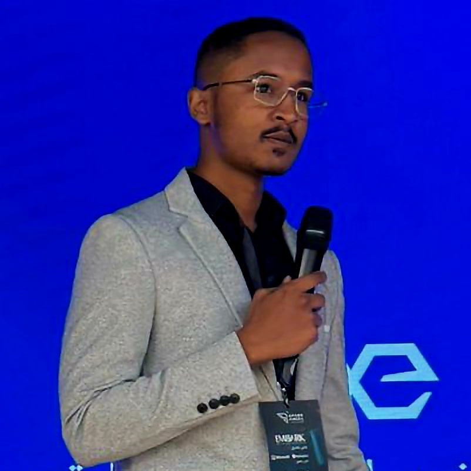
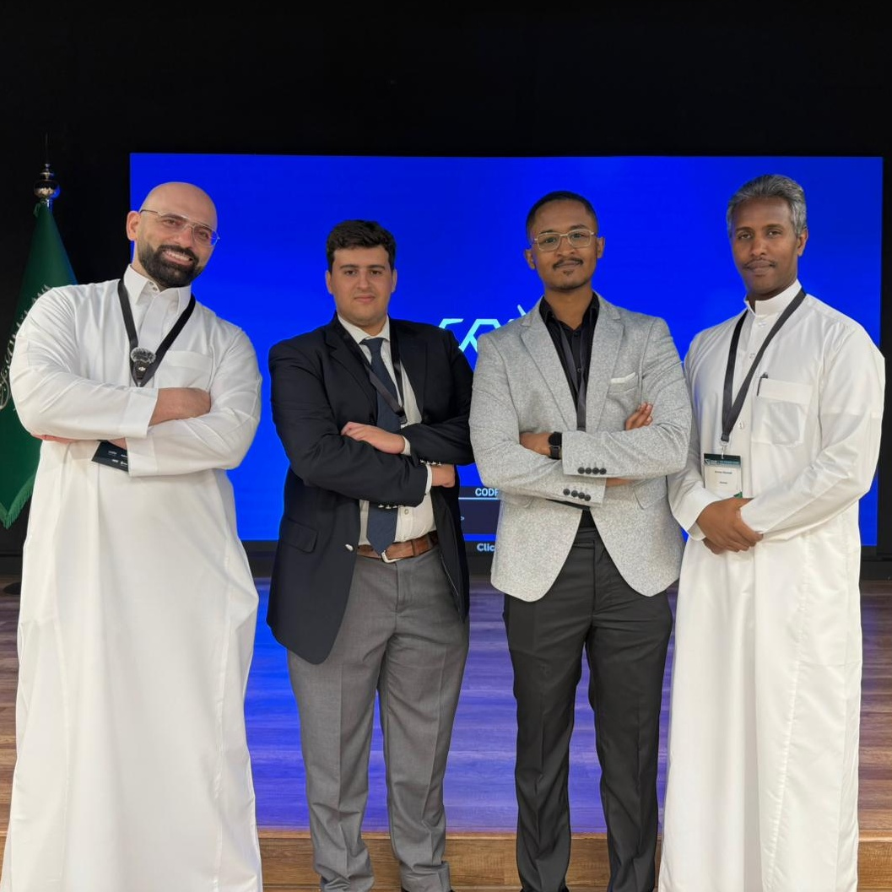
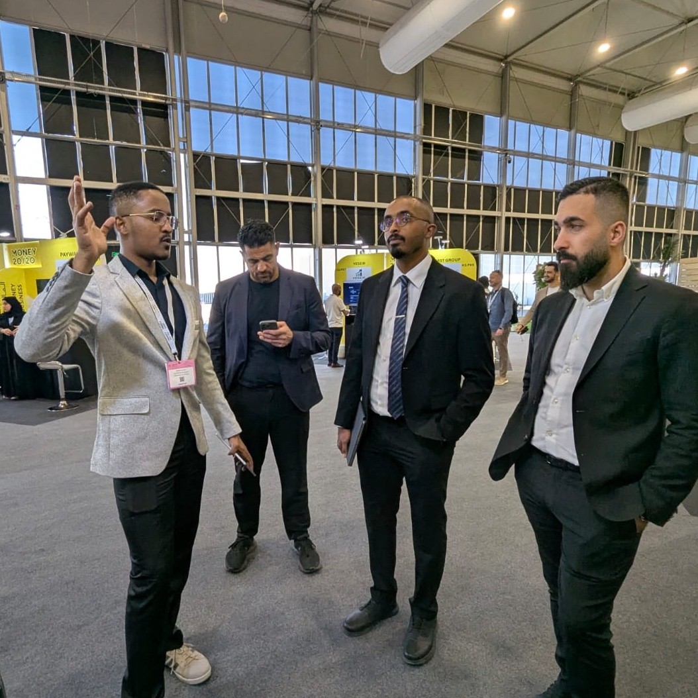
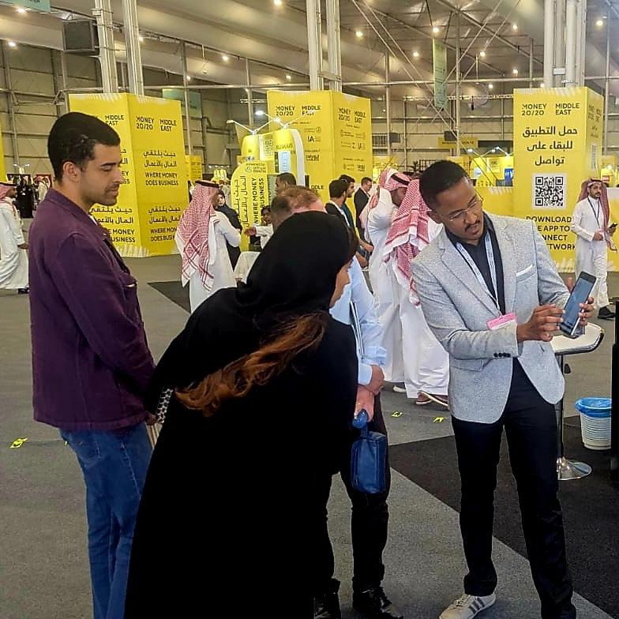

<div align="center">

# Ahmed Abubekr Elagib

**Data Platform Engineer · Cloud-Native Backend · Distributed Systems**

*I build the data infrastructure, then I go explain it to the room.*

[](#) [](https://theseriesa.substack.com/) [](#)
</div>

<div align="center">

[Stack](#the-stack) · [Activity](#commit-activity-work--personal) ·[Projects](#selected-projects) · [In The Field](#in-the-field) · [Series A](#series-a) · [Open To](#open-to)

</div>

---

## What I Do

I'm a backend and data platform engineer with 3 years of experience building systems that move, clean, and serve data at production scale.

My work sits at the intersection of **data engineering**, **cloud infrastructure**, and **backend systems** — I design the pipelines, own the infra they run on, and work directly with product and business stakeholders to turn raw data into decisions.

- 🏗 Currently: Building [`GitInsight`](https://github.com/AhmedAbubaker98/GitInsight) — an AI codebase intelligence platform (FastAPI · Redis · Kubernetes · OpenAI)
- 🌍 Goal: Data Platform Engineer at a European tech company (NL-focused)
- ☁️ Certified: **AWS Solutions Architect – Associate** · **GitHub Advanced Security**

---

## The Stack

```python
stack = {
    "languages":    ["Python", "Go", "Java", "SQL", "Bash"],
    "data":         ["dbt", "Kafka", "ETL/ELT design", "Great Expectations", "PySpark"],
    "backend":      ["FastAPI", "REST APIs", "Celery", "Redis queues", "OpenAPI"],
    "cloud":        ["AWS (EC2, S3, RDS, SQS, IAM, Glue, Redshift)", "GCP", "Terraform"],
    "infra":        ["Kubernetes", "Docker", "Helm", "GitHub Actions CI/CD"],
    "databases":    ["PostgreSQL", "MongoDB", "Redis", "MySQL"],
    "practices":    ["Data contracts", "Schema versioning", "SLO design", "Incident response"]
}
```

---

## Commit Activity (Work + Personal)

<div align="center">





</div>

---

## Selected Projects

| Project | Stack | What it does |
|---|---|---|
| [**GitInsight**](https://github.com/AhmedAbubaker98/GitInsight) | FastAPI · Redis · PostgreSQL · K8s · OpenAI | AI codebase intelligence: ingest any GitHub repo, surface architecture insights, dependency graphs, and natural-language explanations. Deployed on Kubernetes with HPA + full CI/CD. |
| **Vehicle Valuation Engine (proprietary)** | Python · FastAPI · PostgreSQL · dbt | Multi-source ingestion platform for 5 automotive data providers + pricing computation engine (customs, VAT, SASO, markup) for an Antler-backed fintech. |

## A Few Things I've Shipped

- 🔧 Built a multi-source vehicle data ingestion platform from scratch — 5 providers, ~8k records/daily refresh cycle, freshness from 24h → 45 min
- 🧮 Architected a vehicle valuation engine calculating landed cost (customs, VAT, SASO, shipping, margin) per VIN — eliminated ~90% of manual pricing work
- 🔒 Served as sole incident responder during a live cyberattack — rotated AWS root credentials, secured CI/CD environments, recovered production PostgreSQL DB from a locked GCP account to Neon with **zero data loss**
- 📊 Replaced 2,400 lines of ad-hoc SQL with 38 dbt models — cut data incident rate from ~7/month to <2
- 🏆 **Money20/20 Middle East Pitch Competition Finalist** — demoed live to fintech investors

---

## In The Field

> *"The best engineers can build it and explain it to anyone in the room."*

These aren't conference selfies. The first row is from the [SparkAngel](https://event.sparkangel.net/SparkAngelSpecialEdition1) Investor Mixer by Numu Angels, and the second row is from [Money20/20 Middle East](https://www.money2020.com/) where I represented the booth as the technical lead — demoing the product to customers, banks, and investors while explaining the architecture behind it.

<div align="center">
<table>
  <tr>
    <td align="center" width="50%">
      
    </td>
    <td align="center" width="50%">
      
    </td>
  </tr>
  <tr>
    <td align="center" colspan="2">
      <sub><b>SparkAngel Investor Mixer by Numu Angels at the Digital Government Authority</b></sub>
    </td>
  </tr>
  <tr>
    <td align="center" width="50%">
      
    </td>
    <td align="center" width="50%">
      
    </td>
  </tr>
  <tr>
    <td align="center" colspan="2">
      <sub><b>Pitching at Money20/20 for customers, banks, and investors</b></sub>
    </td>
  </tr>
</table>
</div>

---

## Series A

<div align="center">
  <a href="https://theseriesa.substack.com/">
    
  </a>
</div>

<br/>

I write **[Series A](https://theseriesa.substack.com/)** — a newsletter delivering high-signal intelligence for Founders, VCs, and AI Engineers.

Not a summary digest. Not a hot take thread. Each issue covers one idea at the intersection of **engineering, markets, and building** — written by someone who's done the startup ops, shipped the infra, and sat in front of investors explaining both.

**What you'll find:**
- How real data systems get built inside fast-moving companies
- Funding signals and what they mean for technical founders
- AI engineering patterns that actually make it to production
- The decisions nobody writes about until the company exits

<div align="center">
  <a href="https://theseriesa.substack.com/">
    
  </a>
</div>

**→ [Read and subscribe on Substack](https://theseriesa.substack.com/)**

---

## Currently Reading / Studying

- 📖 *Designing Data-Intensive Applications* — Martin Kleppmann
- 📖 *System Design Interview Vol. 1 & 2* — Alex Xu
- 🧠 NeetCode DSA roadmap (daily)
- ☁️ Databricks Certified Data Engineer Professional (in progress)

---


## Open To
<div align="center">

*Data Platform / Data Engineering roles in the Netherlands*
*Familiar with HSM visa process. Ready to relocate.*

**Let's build something that actually moves data reliably.**

</div>
<!-- 
 -->

<!-- | -->
